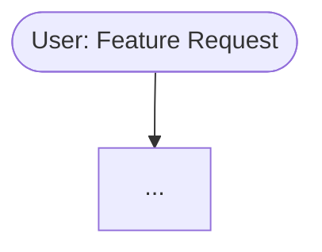

# From Prompt to Product: Building AI Apps by Spec
### A 90-Minute Developer Workshop

---

## Welcome

### Every developer in this room has talked to an AI and gotten something useless back.

- You described what you wanted. It built something else.
- You clarified. It apologized and built something else again.
- You hit token limits. You started over. You lost context. You got frustrated.

**There's a better way. It's called Spec Building.**

---

## What We'll Cover

- What agentic AI actually is — and how it's changing development
- Why vibe coding breaks down at scale
- The 6 building blocks of any AI-powered system
- Context windows, token budgets, and optimization
- Spec Building: a structured framework for shipping with AI
- 3 hands-on exercises you can use tomorrow

> *90 minutes. All practical. You'll leave with working artifacts.*

---

# Part 1: The Landscape of Agentic AI

---

## Beyond Autocomplete: What Is Agentic AI?

**Traditional AI assistant:** You ask → It answers → You act

**Agentic AI:** You set a goal → It plans → It calls tools → It executes → It reports back

The key shift:
- AI agents can **use tools** (read/write files, call APIs, run code)
- They can **plan multi-step tasks** without hand-holding
- They can **spawn sub-tasks** and work in parallel
- They maintain **state and memory** across a session

> *Think less "smart autocomplete" and more "junior developer who works at machine speed."*

---

## The Agentic Toolscape

| Tool | Type | Strength |
|---|---|---|
| **GitHub Copilot** | IDE inline + chat | Code completion, PR review |
| **Codex / o3** | API-level reasoning | Complex multi-file tasks |
| **Gemini Code Assist** | Google Workspace + IDE | Long context, multimodal |
| **Claude Code** | Terminal CLI agent | File system, shell, planning |
| **Cursor** | AI-first IDE | Chat + composer, codebase awareness |
| **Windsurf** | IDE agent | Cascade multi-step flows |
| **Copilot Workspace** | GitHub-native | Issue → PR pipeline |

**Common thread:** All of them are most powerful when you give them a *spec*, not just a vibe.

---

## The Agentic Loop

```
Human Intent
     ↓
  [Agent] ← System Prompt + Instructions
     ↓
  Planning
     ↓
  Tool Calls ←→ MCP / Skills / APIs
     ↓
  Execution
     ↓
  Response + Artifacts
     ↓
Human Review
```

The agent loops until the goal is met — or until it runs out of context.

**This is why context management is a first-class skill.**

---

# Part 2: The Problem with Vibe Coding

---

## What Is Vibe Coding?

> *"I just describe what I want and let the AI figure it out."*

Vibe coding is **intuition-driven, prompt-by-prompt development.**

- No system context
- No constraints or guardrails
- No shared vocabulary between you and the model
- Instructions embedded in the conversation — and forgotten

**It works great for prototypes. It falls apart for anything real.**

---

## Why Vibe Coding Breaks Down

**The Degradation Spiral:**

1. You ask the AI to build something. It makes reasonable assumptions.
2. It's close, but not quite right. You clarify.
3. Each clarification uses tokens. Context fills up.
4. The model loses track of earlier decisions.
5. It contradicts itself. Breaks things it already built.
6. You spend more time debugging AI output than writing code.

**The hidden costs:**
- Excessive token usage = real money at scale
- Context thrashing = hours of re-explanation
- Inconsistent output = unreliable product
- No repeatability = can't hand off to another session

---

## The Spec Advantage

| Vibe Coding | Spec Building |
|---|---|
| Instructions in the chat | Instructions in structured files |
| Model guesses at intent | Intent is explicit and versioned |
| Context fills with re-explanation | Context is reserved for work |
| Hard to reproduce | Deterministic and repeatable |
| Single-session | Multi-session, multi-agent |

**A spec is a contract between your intent and the AI's execution.**

---

# Part 3: What Is Spec Building?

---

## Spec Building Defined

A **spec** is a structured document (or set of documents) that gives an AI agent everything it needs to execute a task reliably — without requiring you to be present.

Three layers:
1. **What** you want built (requirements)
2. **How** it should be built (technical constraints, patterns, architecture)
3. **Who** does the work (which agents, with what personas and guardrails)

> *A well-written spec lets you hand off to an AI like you'd hand off to a developer.*

---

## The Spec → Plan → Execute Pipeline

```
Business Requirements (BRD)
         ↓
Technical Requirements (TRD)
         ↓
Design + Architecture
         ↓
Plan (structured JSON/YAML)
         ↓
Scaffold (file structure, stubs)
         ↓
Build (implementation)
         ↓
Assess + Review
```

Each phase feeds the next. Each phase can be assigned to a specific agent.

---

# Part 4: The 6 Building Blocks

---

## Meet the Building Blocks

Every agentic system — no matter the platform — is assembled from 6 primitives:

| Block | Question | Examples |
|---|---|---|
| **Agent / Persona** | *Who* is doing the work? | "Senior backend engineer", "QA specialist" |
| **Instructions** | *Rules* to follow? | Guardrails, style guides, do/don't lists |
| **Context** | *Where* does it work? | Files, docs, memory, codebase |
| **Prompts** | *What* is the task? | User request, slash command, trigger |
| **Skills** | *How* to do it? | Reusable scripts and workflows |
| **MCP** | *How* to connect? | External tools via protocol |

---

## Who: Agents & Personas

An **agent** is an AI model configured with a specific identity, expertise, and purpose.

A **persona** defines:
- Domain expertise ("you are a senior TypeScript developer")
- Tone and communication style
- Scope of authority ("do not modify production configs")
- What the agent knows vs. doesn't know

**Why it matters:** A general-purpose model gives general-purpose answers. A well-scoped persona gives expert-level, contextually-appropriate output.

*Example:*
```
You are a principal software architect specializing in distributed systems.
You favor simplicity, explain trade-offs, and never propose solutions
that introduce new dependencies without justification.
```

---

## Guardrails: Instructions

**Instructions** are the rules, constraints, and behavioral guidelines your agent operates under.

Types of instructions:
- **Behavioral:** "Always ask for clarification before deleting files"
- **Quality:** "All code must have JSDoc comments"
- **Scope:** "Only modify files in /src — never touch /config"
- **Format:** "Respond in JSON. Never add markdown code fences."
- **Safety:** "If you're unsure, stop and ask. Don't guess."

**Where they live:**
- `CLAUDE.md` / `.github/copilot-instructions.md`
- System prompts
- Agent configuration files

---

## Where: Context

**Context** is everything the agent knows about *where* it's working.

Sources of context:
- **Files:** The codebase, docs, schemas, test results
- **Memory:** Prior decisions, conversation summaries
- **RAG:** Indexed knowledge bases
- **Environment:** What tools are available, what platform is in use
- **History:** What was already tried and why

**Context is your most valuable and most limited resource.**

> *You get one context window. Spend it wisely.*

---

## What: Prompts

A **prompt** is the actual task request — the "what do I want right now."

Good prompts are:
- **Specific:** "Refactor `getUserById` to use the repository pattern" not "clean up the code"
- **Scoped:** Include only relevant context
- **Actionable:** Clear success criteria
- **Composable:** Can be triggered via slash commands or scripts

**Slash commands** are reusable prompts you can invoke on demand:
```
/brd    → Generate a Business Requirements Document
/trd    → Generate a Technical Requirements Document
/plan   → Break down work into an agent-ready JSON plan
/review → Run a code quality assessment
```

---

## How: Skills vs MCP

Both Skills and MCP answer the question "how does the agent do things" — but they're different tools for different jobs.

### Skills

- **Reusable scripts** the agent can execute
- Run **inside** your environment (shell, Python, Node)
- Examples: parse a JSON plan, run tests, generate a report, compact memory
- **You own and maintain them**
- Best for: domain-specific logic, repeated workflows, internal automation

### MCP (Model Context Protocol)

- **Protocol** for connecting agents to **external services**
- Examples: Slack, GitHub, Jira, Google Calendar, databases
- Run as **separate processes** the agent communicates with
- **Built by integrations, not you**
- Best for: reading/writing from external systems, real-time data

> **Rule of thumb:** Skills for *doing*, MCP for *connecting*.

---

## Subagents & Parallel Execution

When a plan has independent tasks, there's no reason to run them sequentially.

**Subagents** are child agents spawned by an orchestrator to handle specific tasks in parallel.

```
Orchestrator Agent
      ├── Subagent A: Build API endpoints
      ├── Subagent B: Write unit tests
      ├── Subagent C: Generate documentation
      └── Subagent D: Create database migrations
```

Benefits:
- Dramatically reduces total execution time
- Each subagent has a focused context (no token bloat)
- Failures are isolated — one subagent fails, others continue
- Output can be merged by the orchestrator

**Pattern:** Plan defines tasks → skill extracts tasks with `jq` → orchestrator spawns parallel subagents

---

# Part 5: Context Windows & Budget Management

---

## Context Window Reference

| Model | Context Window | Notes |
|---|---|---|
| **Claude Opus 4** | 200K tokens | ~150K words |
| **Claude Sonnet 3.7** | 200K tokens | Best cost/performance |
| **GPT-4o** | 128K tokens | Multimodal |
| **o3 / o4-mini** | 200K tokens | Reasoning-optimized |
| **Gemini 1.5 Pro** | 1M tokens | Longest context available |
| **Gemini 2.0 Flash** | 1M tokens | Fast + long context |
| **Copilot (GPT-4o)** | 128K tokens | IDE context-limited |

**Reality check:** Just because you have 200K tokens doesn't mean you should use them all.

---

## Request Size vs Response Size

Your context window has two "sides":

**Input (Request):**
- System prompt + instructions
- Conversation history
- Files and documents loaded into context
- Tool results returned to the model

**Output (Response):**
- The model's reply
- Code generated
- Plans written
- Tool calls made

**The more context you consume, the higher the cost and the more likely the model degrades in quality at the edges.**

---

## Budget Allocation Strategy

Think of your context window like a budget with line items:

```
Total Budget: 200K tokens
━━━━━━━━━━━━━━━━━━━━━━━━━━━━━━━━━━━
System Prompt + Persona:        ~2K
Instructions (CLAUDE.md):       ~3K
Current File/Active Context:   ~20K
Conversation History:          ~30K
Tool Results:                  ~15K
━━━━━━━━━━━━━━━━━━━━━━━━━━━━━━━━━━━
Working Budget Remaining:      ~130K
━━━━━━━━━━━━━━━━━━━━━━━━━━━━━━━━━━━
Reserve (buffer):               ~20K
━━━━━━━━━━━━━━━━━━━━━━━━━━━━━━━━━━━
Effective Working Space:       ~110K
```

---

## Keeping Within Budget

**In your instructions:**
- Explicitly tell the agent its budget constraints
- "Do not load more than 3 files into context at once"
- "Summarize completed work before starting new tasks"

**Compacting:**
- Ask the agent to compress conversation history
- `/compact` → summarize what's been done, forget the details
- Store decisions in memory files, not the chat

**AI Offloading to Skills:**
- Move heavy computation OUT of the context window
- A skill runs a script → returns only the result
- Example: instead of loading 500 lines of JSON, a skill runs `jq` and returns 10 lines

**Memory Files:**
- `CLAUDE.md` — persistent instructions that survive context resets
- `memory/` — indexed facts about the project the agent can query

---

# Exercise 1: Build an Orchestrator & Prompt Optimizer

---

## Exercise 1 Overview

**Goal:** Build a system prompt for an orchestrator agent that enforces a token budget, and create a prompt-optimization sub-prompt that refines user inputs before execution.

**Time:** 15 minutes

**What you'll build:**
1. An orchestrator system prompt with embedded budget constraints
2. A "prompt optimizer" persona that rewrites user prompts to be spec-quality
3. Test both against a vague prompt

**Skills practiced:** Persona design, instruction writing, budget enforcement

> See **Exercise 1 Lab Guide** for step-by-step instructions.

---

# Part 6: Spec Building Components

---

## The 7 Phases of Spec Building

```
1. Business Requirements (BRD)
   "What problem are we solving and for whom?"

2. Technical Requirements (TRD)
   "What must be built, at what quality, with what constraints?"

3. Design + Architecture
   "How will the system be structured?"

4. Plan
   "What are the discrete tasks, assigned to which agents?"

5. Scaffold
   "Create the skeleton: folders, stubs, config files."

6. Build
   "Implement each component per the spec."

7. Assess + Review
   "Did we build the right thing? Does it meet the requirements?"
```

---

## Phase Breakdown

### Business Requirements (BRD)
- Problem statement, target users, success metrics
- Scope definition (in/out of scope)
- Stakeholder constraints (budget, timeline, compliance)

### Technical Requirements (TRD)
- Stack decisions, API contracts, data models
- Non-functional requirements (performance, security, scalability)
- Integration requirements

### Design + Architecture
- System diagram, data flow, component boundaries
- Technology choices with rationale

### Plan
- Discrete task list in structured JSON
- Agent assignments per task
- Dependencies and parallel opportunities

### Scaffold
- Directory structure, boilerplate, config stubs
- Sets up the workspace the Build phase fills in

### Build
- Feature implementation, test writing, integration
- Each task maps back to a plan item

### Assess + Review
- Quality check against requirements
- Code review, test coverage, spec compliance

---

# Exercise 2: Slash Commands for Each Phase

---

## Exercise 2 Overview

**Goal:** Build a set of slash commands (reusable prompts) for each phase of spec building that any developer can drop into their AI tool of choice.

**Time:** 10 minutes

**What you'll build:**
- `/brd` — Business Requirements prompt
- `/trd` — Technical Requirements prompt
- `/arch` — Architecture design prompt
- `/plan` — JSON plan generation prompt
- `/review` — Spec compliance review prompt

**Skills practiced:** Prompt engineering, slash command design, reusable prompt patterns

> See **Exercise 2 Lab Guide** for step-by-step instructions and templates.

---

# Exercise 3: JSON Plan + Parallel Subagents

---

## Exercise 3 Overview

**Goal:** Create a structured JSON plan for a real feature, then run a skill that extracts individual tasks using `jq` and spawns them as parallel subagents.

**Time:** 10 minutes

**What you'll build:**
1. A `plan.json` with 4 independent tasks
2. A skill script that uses `jq` to extract tasks
3. An orchestrator prompt that spawns parallel subagents from the extracted tasks

**Skills practiced:** JSON plan design, jq extraction, parallel subagent orchestration

> See **Exercise 3 Lab Guide** for step-by-step instructions and starter files.

---

# Wrap-Up

---

## Key Takeaways

1. **Vibe coding doesn't scale.** Specs do.
2. **The 6 building blocks** — Agent, Instructions, Context, Prompt, Skills, MCP — are in every serious AI system.
3. **Context is currency.** Budget it. Compact it. Offload computation to skills.
4. **Skills are for doing. MCP is for connecting.** Don't confuse them.
5. **Parallel subagents** multiply your throughput. Plan for independence.
6. **Spec Building gives you repeatability.** You can hand off, reproduce, and improve.

---

## Your Starting Kit

Take these with you:

- **Slash command templates** (from Exercise 2) → drop into any AI tool
- **Orchestrator system prompt** (from Exercise 1) → reuse as a base persona
- **plan.json template** (from Exercise 3) → adapt for any project
- **Budget allocation framework** → use in every new project's `CLAUDE.md`

---

## Resources

- [Claude Code docs](https://docs.anthropic.com/claude-code) — Claude Code CLI reference
- [MCP Protocol](https://modelcontextprotocol.io) — Model Context Protocol spec
- [GitHub Copilot Instructions](https://docs.github.com/copilot/customizing-copilot) — Custom instructions guide
- [Anthropic Prompt Engineering Guide](https://docs.anthropic.com/en/docs/build-with-claude/prompt-engineering/overview)

---

*From Prompt to Product: Building AI Apps by Spec*
*Workshop materials v1.0 · April 2026*

---

# Optional Advanced Lessons
### Use when time permits — each is ~15–20 minutes

> *These four lessons are modular. Run any combination in any order after the core 90-minute session, or as standalone deep-dives in a follow-up workshop.*

---

## Optional Lesson 1: Object-Oriented Instructions

### The Problem with Flat Instruction Files

Most developers write one big `CLAUDE.md` and call it done. It works — until:
- The file becomes 500 lines and nobody knows what's in it
- You have 6 agents with 80% overlapping rules and 20% unique ones
- You change one rule and have to hunt for it in every agent's config
- A new team member has no idea which rules apply to which context

Sound familiar? You've already solved this problem in code. It's called **inheritance**.

---

### Applying OOP Principles to Instructions

Map the concepts you already know:

| OOP Concept | Instruction Equivalent |
|---|---|
| **Abstract base class** | `base-agent.md` — universal rules for all agents |
| **Inheritance** | Agent-specific files that `@include` the base |
| **Override** | Child instruction overrides a specific base rule |
| **Interface** | Contract: "any agent in this system must implement X" |
| **Composition** | Mixing in role-specific instruction modules |

---

### The Reference Pattern

Instead of duplicating rules, agents reference shared instruction files:

```
instructions/
├── base/
│   ├── code-quality.md       # Universal: naming, comments, error handling
│   ├── security.md           # Universal: never log secrets, sanitize inputs
│   └── communication.md      # Universal: tone, format, escalation
├── roles/
│   ├── backend-engineer.md   # @includes base/* + backend-specific rules
│   ├── frontend-engineer.md  # @includes base/* + frontend-specific rules
│   └── qa-engineer.md        # @includes base/* + testing-specific rules
└── domains/
    ├── payments.md            # Mixed in when agent touches payment code
    ├── auth.md                # Mixed in when agent touches auth code
    └── data-privacy.md        # Mixed in for any PII-handling agent
```

**At runtime:** An agent handling a payment API endpoint loads:
`base/code-quality.md` + `base/security.md` + `roles/backend-engineer.md` + `domains/payments.md`

---

### Building the Reference Loader

A simple skill reads an agent's config and resolves its full instruction set:

```bash
# resolve-instructions.sh
# Usage: ./resolve-instructions.sh agent-config.json
# Outputs a single merged instruction file for the agent

AGENT_CONFIG="$1"
OUTPUT_FILE="${2:-resolved-instructions.md}"

> "$OUTPUT_FILE"  # clear output

# Read includes from agent config
jq -r '.instructions.includes[]' "$AGENT_CONFIG" | while read -r include_path; do
  echo "## From: $include_path" >> "$OUTPUT_FILE"
  cat "$include_path" >> "$OUTPUT_FILE"
  echo "" >> "$OUTPUT_FILE"
done

# Append agent-specific overrides last (they win)
OVERRIDES=$(jq -r '.instructions.overrides // empty' "$AGENT_CONFIG")
if [[ -n "$OVERRIDES" ]]; then
  echo "## Agent-Specific Overrides" >> "$OUTPUT_FILE"
  echo "$OVERRIDES" >> "$OUTPUT_FILE"
fi

echo "Resolved instruction set written to: $OUTPUT_FILE"
wc -l "$OUTPUT_FILE"
```

**Agent config example:**
```json
{
  "agent": "payments-backend-engineer",
  "instructions": {
    "includes": [
      "instructions/base/code-quality.md",
      "instructions/base/security.md",
      "instructions/roles/backend-engineer.md",
      "instructions/domains/payments.md"
    ],
    "overrides": "Never add logging statements in payment processing functions. Use the audit trail service instead."
  }
}
```

---

### Exercise: Build a 3-Level Instruction Hierarchy

**Time: 15 minutes**

1. Create a `base/` instruction file with 5 universal rules for your team
2. Create two role files (`backend-engineer.md`, `frontend-engineer.md`) that each `@include` base + add 3 role-specific rules
3. Create one domain file (`api-design.md`) with 3 API-specific constraints
4. Write a `resolve-instructions.sh` script that merges them
5. Compare: run the same prompt through a flat instruction file vs. the resolved hierarchy

**What to observe:** Token efficiency, rule clarity, override behavior

> See **Optional Lesson 1 Guide** for full templates and step-by-step instructions.

---

## Optional Lesson 2: Dynamic Agents via Skill-Managed Indexes

### The Static Context Problem

Most agent setups hardcode what context to load:
- "Always load these 5 files"
- "Always include this documentation"
- "Always attach this schema"

This works at project start. It breaks as projects grow.

By month three, your "always load these 5 files" has become 50 files. Your context is bloated. Agents load irrelevant information. Quality degrades.

**The solution: let agents discover what they need, rather than preloading everything they might need.**

---

### Skill-Managed Resource Indexes

An **index** is a structured catalog of available resources — files, docs, schemas, APIs, knowledge bases — along with metadata that helps an agent decide whether to load them.

```json
{
  "index_version": "1.0",
  "last_updated": "2026-04-07",
  "resources": [
    {
      "id": "user-service-schema",
      "path": "src/schemas/user.schema.ts",
      "tags": ["users", "authentication", "database"],
      "description": "TypeScript interfaces for the User entity and related types",
      "token_estimate": 450,
      "last_modified": "2026-03-15"
    },
    {
      "id": "payment-api-docs",
      "path": "docs/payment-api.md",
      "tags": ["payments", "stripe", "billing"],
      "description": "Integration guide and API reference for Stripe payment processing",
      "token_estimate": 2100,
      "last_modified": "2026-04-01"
    }
  ]
}
```

---

### The Lookup Skill

A skill exposes the index to the agent. The agent queries it before loading any context:

```bash
#!/usr/bin/env bash
# lookup-resources.sh
# Usage: ./lookup-resources.sh "tags to match" [max_tokens]
# Returns matching resource paths from the index

QUERY_TAGS="$1"
MAX_TOKENS="${2:-20000}"
INDEX_FILE="${RESOURCE_INDEX:-./resource-index.json}"

# Find resources matching any of the query tags, within token budget
jq --arg tags "$QUERY_TAGS" --argjson budget "$MAX_TOKENS" '
  .resources
  | map(select(
      .tags[] as $tag |
      ($tags | split(",") | map(ltrimstr(" ")) | contains([$tag]))
    ))
  | sort_by(.token_estimate)
  | reduce .[] as $r (
      {"items": [], "total": 0};
      if (.total + $r.token_estimate) <= $budget
      then {"items": (.items + [$r]), "total": (.total + $r.token_estimate)}
      else .
      end
    )
  | .items[]
  | "[\(.id)] \(.path) (~\(.token_estimate) tokens)\n  \(.description)"
' "$INDEX_FILE"
```

**Agent workflow:**
1. Task arrives: "Fix the authentication bug in the user login flow"
2. Agent calls `lookup-resources.sh "authentication, users"` with a 15K token budget
3. Skill returns: 3 relevant files totaling 12K tokens
4. Agent loads only those 3 files — not the entire codebase
5. Agent solves the problem with focused, relevant context

---

### Index Maintenance as a Skill

The index stays current through automated maintenance:

```bash
# update-index.sh
# Run on git commit or CI to keep index fresh
# Scans changed files and updates their entries

git diff --name-only HEAD~1 HEAD | while read -r changed_file; do
  # Re-estimate tokens
  TOKEN_EST=$(wc -w < "$changed_file" | awk '{print int($1 * 1.3)}')

  # Extract tags from file path and content (naive implementation)
  TAGS=$(echo "$changed_file" | tr '/_.' ',')

  # Update index entry
  jq --arg path "$changed_file" \
     --argjson tokens "$TOKEN_EST" \
     --arg updated "$(date -u +%Y-%m-%dT%H:%M:%SZ)" \
     '(.resources[] | select(.path == $path)) |= . + {
       token_estimate: $tokens,
       last_modified: $updated
     }' resource-index.json > tmp.json && mv tmp.json resource-index.json

  echo "Updated index entry for: $changed_file"
done
```

---

### Exercise: Build a Dynamic Context Loader

**Time: 15 minutes**

1. Create a `resource-index.json` with 8–10 resources from a real or imagined project
2. Write `lookup-resources.sh` that queries by tags and respects a token budget
3. Write an agent instruction section: "Before loading any files, call `lookup-resources` with the relevant tags for this task"
4. Test: give the agent 3 different tasks and observe which resources it selects for each
5. Compare token usage: dynamic loading vs. always-load-everything

> See **Optional Lesson 2 Guide** for full index schema and skill implementations.

---

## Optional Lesson 3: Parallel Memory Management

### The Multi-Agent Memory Problem

When one agent does work sequentially, memory management is simple: it reads, thinks, writes.

When 4 agents work in parallel, you immediately face:

- **Write conflicts:** Agent A and Agent B both update `memory/decisions.md` simultaneously
- **Stale reads:** Agent C reads a fact that Agent D is in the process of updating
- **Redundant work:** Agent A and Agent B both research the same thing independently
- **Lost context:** Neither agent knows what the other learned

This is the **distributed systems problem** — applied to AI agents.

---

### Memory Zones: Isolate to Prevent Conflicts

The solution is **memory partitioning**: each agent owns its own memory zone, and a merge step reconciles them.

```
memory/
├── shared/                    # Read-only for subagents during execution
│   ├── project-facts.md       # Stable facts: stack, conventions, decisions
│   ├── architecture.md        # System design — set before parallel run
│   └── constraints.md         # Hard rules all agents must follow
├── agents/                    # Agent-owned write zones (no conflicts)
│   ├── task-001/
│   │   ├── progress.md        # What task-001 has done so far
│   │   ├── findings.md        # What task-001 discovered
│   │   └── blockers.md        # What task-001 is stuck on
│   ├── task-002/
│   │   ├── progress.md
│   │   ├── findings.md
│   │   └── blockers.md
│   └── task-003/
│       └── ...
└── merged/                    # Written by orchestrator after all agents complete
    ├── decisions.md            # Consolidated decisions from all agents
    ├── findings.md             # Merged findings, deduplicated
    └── next-session.md         # Handoff context for the next run
```

**Rule:** Subagents read from `shared/` and write only to `agents/<their-task-id>/`. The orchestrator merges `agents/*/` into `merged/` after all tasks complete.

---

### The Memory Merge Skill

```bash
#!/usr/bin/env bash
# merge-agent-memory.sh
# Run by orchestrator after all parallel subagents complete
# Merges per-agent findings into consolidated memory

AGENTS_DIR="${1:-./memory/agents}"
MERGED_DIR="${2:-./memory/merged}"
DATE=$(date -u +%Y-%m-%dT%H:%M:%SZ)

mkdir -p "$MERGED_DIR"

echo "# Merged Agent Findings — $DATE" > "$MERGED_DIR/findings.md"
echo "" >> "$MERGED_DIR/findings.md"

# Merge findings from all agents
for AGENT_DIR in "$AGENTS_DIR"/*/; do
  TASK_ID=$(basename "$AGENT_DIR")
  FINDINGS_FILE="$AGENT_DIR/findings.md"

  if [[ -f "$FINDINGS_FILE" && -s "$FINDINGS_FILE" ]]; then
    echo "## From Task: $TASK_ID" >> "$MERGED_DIR/findings.md"
    cat "$FINDINGS_FILE" >> "$MERGED_DIR/findings.md"
    echo "" >> "$MERGED_DIR/findings.md"
  fi
done

# Collect all blockers for orchestrator review
echo "# Open Blockers — $DATE" > "$MERGED_DIR/blockers.md"
for AGENT_DIR in "$AGENTS_DIR"/*/; do
  TASK_ID=$(basename "$AGENT_DIR")
  BLOCKERS_FILE="$AGENT_DIR/blockers.md"

  if [[ -f "$BLOCKERS_FILE" && -s "$BLOCKERS_FILE" ]]; then
    echo "## Task $TASK_ID:" >> "$MERGED_DIR/blockers.md"
    cat "$BLOCKERS_FILE" >> "$MERGED_DIR/blockers.md"
    echo "" >> "$MERGED_DIR/blockers.md"
  fi
done

echo "Memory merge complete."
echo "  Findings: $MERGED_DIR/findings.md"
echo "  Blockers: $MERGED_DIR/blockers.md"
```

---

### Shared Memory Locking (Advanced)

For cases where agents genuinely need to write to a shared resource (rare but real), use file-based locking:

```bash
# acquire-lock.sh
LOCK_FILE="./memory/shared/.write-lock"
MAX_WAIT=30
ELAPSED=0

while [[ -f "$LOCK_FILE" ]]; do
  sleep 1
  ELAPSED=$((ELAPSED + 1))
  if [[ $ELAPSED -ge $MAX_WAIT ]]; then
    echo "ERROR: Could not acquire write lock after ${MAX_WAIT}s" >&2
    exit 1
  fi
done

echo "$$:$(date -u +%s)" > "$LOCK_FILE"
echo "Lock acquired by PID $$"

# release-lock.sh
rm -f "./memory/shared/.write-lock"
echo "Lock released"
```

---

### Memory Handoff: Surviving Context Resets

At the end of a session, the orchestrator writes a **handoff document** — a compact summary that bootstraps the next session:

```markdown
# Session Handoff — 2026-04-07 14:30 UTC

## What Was Completed
- task-001: NotificationPreferences model created and migrated ✅
- task-003: NotificationPreferencesPanel component built ✅

## What's In Progress
- task-002: API endpoints 80% complete — PATCH endpoint needs error handling

## Key Decisions Made
- Used JSON column for `channels` instead of a junction table (simplicity > normalization at this scale)
- Component uses optimistic updates with rollback on API failure

## Next Session Should Start With
1. Complete error handling in PATCH /notification-preferences/:type
2. Run task-004 (integration tests) once task-002 is complete
3. Run /review against the original TRD

## Files Modified This Session
- src/models/NotificationPreferences.ts
- src/database/migrations/001_create_notification_preferences.ts
- src/components/NotificationPreferencesPanel.tsx
```

---

### Exercise: Design a Parallel Memory System

**Time: 15 minutes**

1. Design the memory directory structure for a 3-agent parallel run
2. Write a `subagent-memory-init.sh` skill that creates an agent's memory zone on startup
3. Write `merge-agent-memory.sh` that consolidates findings post-run
4. Draft the "Memory Rules" section for your subagent orchestrator prompt
5. Test: simulate two agents writing findings independently, then merge

> See **Optional Lesson 3 Guide** for full templates, locking patterns, and handoff document structure.

---

## Optional Lesson 4: Prompt Flow with Mermaid & PlantUML

### Beyond Linear Execution

Most agent workflows are described in prose: "first do A, then B, then C." This creates problems:
- Flows are invisible — you can't see the logic at a glance
- Conditional branches are buried in text
- Parallel paths aren't obvious
- Handoffs between agents are implied, not explicit
- Debugging a failed workflow requires reading the entire prompt

**What if your prompt pipeline was a diagram first — and executable second?**

---

### Prompt Flow as a Diagram

A **Prompt Flow** maps:
- Each prompt or agent as a **node**
- Transitions as **edges** (with conditions if needed)
- Parallel paths as **parallel branches**
- Decision points as **diamonds**
- Entry/exit points explicitly labeled

```mermaid
flowchart TD
    A([User Request]) --> B[Prompt Optimizer]
    B --> C{Is spec complete?}
    C -- Yes --> D[/plan command]
    C -- No --> E[Clarify Requirements]
    E --> B

    D --> F[extract-tasks.sh]
    F --> G([Parallel Execution])

    G --> H[Subagent: Backend]
    G --> I[Subagent: Frontend]
    G --> J[Subagent: QA]

    H --> K[merge-agent-memory.sh]
    I --> K
    J --> K

    K --> L[/review command]
    L --> M{Passes review?}
    M -- Yes --> N([Done])
    M -- No --> O[Flag issues to user]
    O --> P{Critical issues?}
    P -- Yes --> Q([Escalate])
    P -- No --> H
```

---

### Why This Matters

**Diagrams as documentation:** Stakeholders, PMs, and new team members can read the flow without understanding prompts.

**Diagrams as specification:** The diagram *is* the spec. Prompts are implementations of the nodes.

**Diagrams as debugging tools:** When a flow fails, you can point to the exact node. "It broke at the `Clarify Requirements` step because the optimizer looped 4 times."

**Diagrams as shareable artifacts:** Export to PNG for slide decks. Embed in Confluence. Version in git alongside your prompts.

---

### PlantUML Alternative: Sequence Diagrams for Agent Interactions

For multi-agent message passing, PlantUML sequence diagrams show *who talks to whom*:

```plantuml
@startuml
title Spec Build Agent Interaction

actor User
participant "Prompt Optimizer" as PO
participant "Orchestrator" as ORC
participant "Backend Subagent" as BE
participant "Frontend Subagent" as FE
database "Memory Store" as MEM

User -> PO: "Add user export feature"
PO -> PO: Rewrite to spec-quality
PO -> ORC: Structured task description

ORC -> MEM: Read shared/project-facts.md
ORC -> ORC: Run /plan command
ORC -> MEM: Write plan.json

par Parallel execution
  ORC -> BE: Spawn with task-001.json
  BE -> MEM: Write agents/task-001/findings.md
  BE --> ORC: TASK COMPLETE: task-001
and
  ORC -> FE: Spawn with task-003.json
  FE -> MEM: Write agents/task-003/findings.md
  FE --> ORC: TASK COMPLETE: task-003
end

ORC -> MEM: Run merge-agent-memory.sh
ORC -> User: Summary + artifacts
@enduml
```

---

### The Prompt Flow Pattern

Each node in your diagram maps to a prompt artifact:

```
Flow Definition (Mermaid/PlantUML)
        │
        ▼
Node Catalog (JSON)
   ├── node-id: "prompt-optimizer"
   │     prompt_file: "prompts/optimizer.md"
   │     inputs: ["user_request"]
   │     outputs: ["refined_prompt"]
   │
   ├── node-id: "extract-tasks"
   │     skill_file: "skills/extract-tasks.sh"
   │     inputs: ["plan.json"]
   │     outputs: ["tasks/*.json"]
   │
   └── node-id: "review"
         prompt_file: "prompts/review.md"
         inputs: ["implementation", "spec"]
         outputs: ["review_report", "pass_fail"]
```

The flow runner reads the diagram, resolves the node catalog, and executes nodes in diagram order — respecting conditional branches and parallel paths.

---

### Exercise: Design and Diagram Your Spec Build Pipeline

**Time: 20 minutes**

1. Map out your ideal spec-to-build flow using the Mermaid `flowchart TD` syntax
   - Include the 7 spec phases from the core session
   - Add at least one decision diamond (e.g., "Does BRD have success metrics?")
   - Add at least one parallel branch (the multi-agent build phase)

2. Create a `node-catalog.json` that maps each diagram node to a prompt file or skill

3. Write a `flow-runner.sh` concept sketch: given a node ID, look up the prompt/skill and execute it

4. Bonus: use PlantUML to create a sequence diagram for the multi-agent memory workflow from Lesson 3

5. Share your diagram — use the Mermaid live editor at [mermaid.live](https://mermaid.live) to render it

**Starting template:**


> See **Optional Lesson 4 Guide** for complete Mermaid/PlantUML templates, the node catalog schema, and flow runner implementation.

---

## Optional Lessons: Timing Guide

| Lesson | Time | Best Used When |
|---|---|---|
| **OO Instructions** | 15 min | Audience is managing multiple agents or large teams |
| **Dynamic Indexes** | 15 min | Audience works with large codebases (context bloat is a pain point) |
| **Parallel Memory** | 20 min | Audience wants to run multi-agent systems in production |
| **Prompt Flow** | 20 min | Audience includes architects, PMs, or visual thinkers |

*Combine any two for a 30-minute "Advanced Topics" bonus session.*
*All four together = 70 minutes of additional material for a full advanced workshop day.*

---

*From Prompt to Product: Building AI Apps by Spec*
*Workshop materials v1.0 · April 2026*
