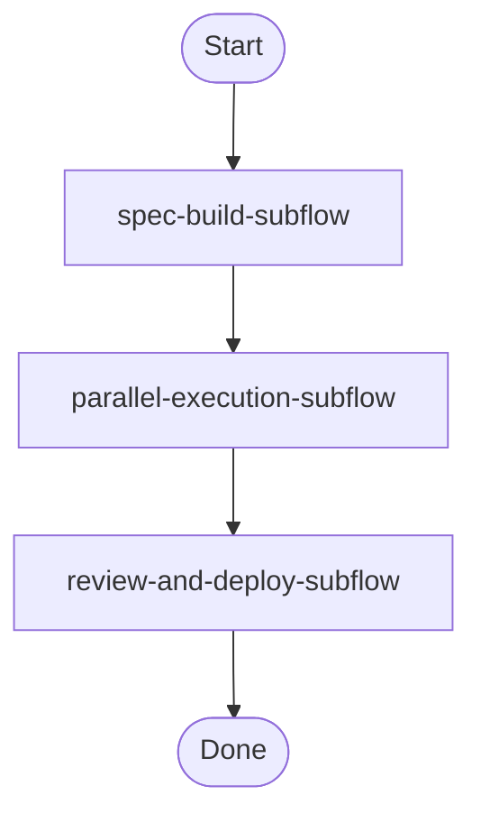

# Optional Lesson 4: Building a Prompt Flow System with Mermaid & PlantUML
### Lab Guide · 20 Minutes

---

## The Core Idea

Your spec-to-build pipeline is software. It has branches, loops, parallel paths, and failure modes. Right now it probably lives in your head or in a prose description that nobody reads.

What if it was a diagram? What if the diagram was the spec — and prompts were the implementations of the nodes?

This lesson teaches you to:
1. Model your prompt pipeline as a Mermaid or PlantUML diagram
2. Map each diagram node to a prompt file or skill
3. Build a lightweight **flow runner** that executes the pipeline in diagram order
4. Debug, extend, and share your pipeline as a visual artifact

---

## Why Diagrams First?

**For you:** A diagram forces you to think about branching logic, failure modes, and parallel paths before you're deep in execution. It's architecture for your prompt pipeline.

**For your team:** Stakeholders, PMs, and new engineers can read the flow without understanding prompt engineering. "The diagram says if the BRD is missing success metrics, loop back to clarify" is immediately understandable.

**For debugging:** When a run fails, you can point to exactly which node failed. The diagram becomes a map for incident response.

**For iteration:** Changing the flow means changing the diagram. All the node implementations stay the same — you just rewire the connections.

---

## The Pattern: Diagram → Catalog → Runner

```
Step 1: Draw the flow (Mermaid or PlantUML)
        ↓
Step 2: Build the node catalog (JSON mapping node IDs to prompt files / skills)
        ↓
Step 3: Run the flow (shell script that reads diagram order, executes nodes)
```

---

## Part A: The Flow Diagram

### Mermaid — for flowcharts and decision trees

Mermaid uses a simple markdown-style syntax. Copy this into [mermaid.live](https://mermaid.live) to render it.

```mermaid
flowchart TD
    START([🚀 User: Feature Request]) --> OPT[Prompt Optimizer]

    OPT --> SPEC_CHECK{Spec quality check}
    SPEC_CHECK -- "Missing context" --> CLARIFY[Clarify Requirements]
    CLARIFY --> OPT
    SPEC_CHECK -- "Ready" --> BRD[/brd — Business Requirements]

    BRD --> BRD_CHECK{Has success metrics?}
    BRD_CHECK -- No --> BRD_FIX[Add success metrics]
    BRD_FIX --> BRD
    BRD_CHECK -- Yes --> TRD[/trd — Technical Requirements]

    TRD --> ARCH[/arch — Architecture Design]
    ARCH --> PLAN[/plan — JSON Task Plan]
    PLAN --> EXTRACT[extract-tasks.sh]

    EXTRACT --> PARALLEL([⚡ Parallel Execution])
    PARALLEL --> BACKEND[Subagent: Backend]
    PARALLEL --> FRONTEND[Subagent: Frontend]
    PARALLEL --> QA[Subagent: QA]

    BACKEND --> MERGE[merge-memory.sh]
    FRONTEND --> MERGE
    QA --> MERGE

    MERGE --> REVIEW[/review — Spec Compliance]
    REVIEW --> REVIEW_CHECK{Passes review?}

    REVIEW_CHECK -- "Critical issues" --> ESCALATE([🚨 Escalate to Human])
    REVIEW_CHECK -- "Minor issues" --> FIX_LOOP[Fix Issues]
    FIX_LOOP --> PARALLEL
    REVIEW_CHECK -- "Passed" --> DONE([✅ Done])

    style START fill:#4CAF50,color:#fff
    style DONE fill:#4CAF50,color:#fff
    style ESCALATE fill:#f44336,color:#fff
    style PARALLEL fill:#2196F3,color:#fff
```

---

### PlantUML — for sequence diagrams (agent-to-agent communication)

Use [planttext.com](https://planttext.com) or the PlantUML VS Code extension to render.

```plantuml
@startuml Spec-Build Agent Interactions

!theme plain
skinparam backgroundColor #FAFAFA
skinparam sequenceArrowThickness 2

actor "Developer" as DEV
participant "Prompt\nOptimizer" as OPT
participant "Orchestrator" as ORC
participant "Backend\nSubagent" as BE
participant "Frontend\nSubagent" as FE
participant "QA\nSubagent" as QA
participant "Memory\nStore" as MEM
database "Artifacts" as ART

DEV -> OPT : Feature request (raw)
OPT -> OPT : Rewrite to spec quality

OPT -> ORC : Refined task description
ORC -> MEM : Read shared/project-context.md

group Spec Building
  ORC -> ORC : Run /brd
  ORC -> ORC : Run /trd
  ORC -> ORC : Run /arch
  ORC -> MEM : Write plan.json
  ORC -> ART : Write specs/brd.md, trd.md, arch.md
end

ORC -> ORC : Run extract-tasks.sh

par Parallel Execution
  ORC -> BE : Spawn task-001 (backend)
  activate BE
  BE -> MEM : Read shared/architecture.md
  BE -> ART : Write src/models/, src/services/
  BE -> MEM : Write agents/task-001/decisions.md
  deactivate BE
  BE -> ORC : COMPLETE: task-001

and
  ORC -> FE : Spawn task-003 (frontend)
  activate FE
  FE -> MEM : Read shared/architecture.md
  FE -> ART : Write src/components/
  FE -> MEM : Write agents/task-003/findings.md
  deactivate FE
  FE -> ORC : COMPLETE: task-003
end

ORC -> MEM : Run merge-memory.sh
ORC -> MEM : Read merged/decisions.md

group Sequential (depends on parallel output)
  ORC -> BE : Spawn task-002 (API endpoints)
  BE -> ART : Write src/routes/, src/controllers/
  BE -> ORC : COMPLETE: task-002

  ORC -> QA : Spawn task-004 (integration tests)
  QA -> ART : Write tests/integration/
  QA -> ORC : COMPLETE: task-004
end

ORC -> ORC : Run /review
ORC -> DEV : Session complete\n[summary + artifacts]

@enduml
```

---

## Part B: The Node Catalog

Each node in your diagram maps to an executable artifact. The catalog is the translation layer.

### `flow-catalog.json`

```json
{
  "catalog_version": "1.0",
  "project": "spec-build-pipeline",
  "nodes": [
    {
      "id": "prompt-optimizer",
      "label": "Prompt Optimizer",
      "type": "prompt",
      "artifact": "prompts/optimizer.md",
      "inputs": ["user_request"],
      "outputs": ["refined_prompt"],
      "timeout_seconds": 30,
      "on_failure": "escalate"
    },
    {
      "id": "clarify-requirements",
      "label": "Clarify Requirements",
      "type": "prompt",
      "artifact": "prompts/clarify.md",
      "inputs": ["refined_prompt"],
      "outputs": ["clarification_questions"],
      "timeout_seconds": 60,
      "on_failure": "escalate"
    },
    {
      "id": "brd",
      "label": "Business Requirements",
      "type": "slash_command",
      "artifact": ".claude/commands/brd.md",
      "inputs": ["refined_prompt"],
      "outputs": ["specs/brd.md"],
      "timeout_seconds": 120,
      "on_failure": "retry_once"
    },
    {
      "id": "trd",
      "label": "Technical Requirements",
      "type": "slash_command",
      "artifact": ".claude/commands/trd.md",
      "inputs": ["specs/brd.md"],
      "outputs": ["specs/trd.md"],
      "timeout_seconds": 120,
      "on_failure": "retry_once"
    },
    {
      "id": "arch",
      "label": "Architecture Design",
      "type": "slash_command",
      "artifact": ".claude/commands/arch.md",
      "inputs": ["specs/trd.md"],
      "outputs": ["specs/arch.md"],
      "timeout_seconds": 120,
      "on_failure": "retry_once"
    },
    {
      "id": "plan",
      "label": "Generate Task Plan",
      "type": "slash_command",
      "artifact": ".claude/commands/plan.md",
      "inputs": ["specs/brd.md", "specs/trd.md", "specs/arch.md"],
      "outputs": ["plan.json"],
      "timeout_seconds": 90,
      "on_failure": "retry_once"
    },
    {
      "id": "extract-tasks",
      "label": "Extract Tasks",
      "type": "skill",
      "artifact": "skills/extract-tasks.sh",
      "inputs": ["plan.json"],
      "outputs": ["tasks/*.json"],
      "timeout_seconds": 10,
      "on_failure": "escalate"
    },
    {
      "id": "spawn-subagents",
      "label": "Parallel Execution",
      "type": "orchestrator",
      "artifact": "prompts/subagent-orchestrator.md",
      "inputs": ["tasks/*.json"],
      "outputs": ["memory/agents/*/"],
      "parallel": true,
      "timeout_seconds": 600,
      "on_failure": "partial_continue"
    },
    {
      "id": "merge-memory",
      "label": "Merge Agent Memory",
      "type": "skill",
      "artifact": "skills/merge-memory.sh",
      "inputs": ["memory/agents/*/"],
      "outputs": ["memory/merged/"],
      "timeout_seconds": 15,
      "on_failure": "escalate"
    },
    {
      "id": "review",
      "label": "Spec Compliance Review",
      "type": "slash_command",
      "artifact": ".claude/commands/review.md",
      "inputs": ["specs/", "memory/merged/"],
      "outputs": ["review-report.md"],
      "timeout_seconds": 120,
      "on_failure": "escalate"
    }
  ],
  "edges": [
    {"from": "prompt-optimizer", "to": "brd", "condition": "spec_ready"},
    {"from": "prompt-optimizer", "to": "clarify-requirements", "condition": "spec_incomplete"},
    {"from": "clarify-requirements", "to": "prompt-optimizer"},
    {"from": "brd", "to": "trd", "condition": "has_success_metrics"},
    {"from": "brd", "to": "brd", "condition": "missing_success_metrics"},
    {"from": "trd", "to": "arch"},
    {"from": "arch", "to": "plan"},
    {"from": "plan", "to": "extract-tasks"},
    {"from": "extract-tasks", "to": "spawn-subagents"},
    {"from": "spawn-subagents", "to": "merge-memory"},
    {"from": "merge-memory", "to": "review"},
    {"from": "review", "to": "spawn-subagents", "condition": "minor_issues"},
    {"from": "review", "to": "done", "condition": "passed"}
  ]
}
```

---

## Part C: The Flow Runner

### `run-flow.sh`

```bash
#!/usr/bin/env bash
# run-flow.sh
# Usage: ./run-flow.sh <catalog.json> <start-node> [input-file]
# Executes a prompt flow starting from a specified node.
# Resolves the artifact for each node and prints execution instructions.

set -euo pipefail

CATALOG="${1:-flow-catalog.json}"
START_NODE="${2:-prompt-optimizer}"
INPUT="${3:-}"

if [[ ! -f "$CATALOG" ]]; then
  echo "Error: Catalog '$CATALOG' not found." >&2
  exit 1
fi

echo "======================================"
echo "  Prompt Flow Runner"
echo "  Catalog: $CATALOG"
echo "  Starting at: $START_NODE"
echo "======================================"
echo ""

# Get node details
get_node() {
  local node_id="$1"
  jq --arg id "$node_id" '.nodes[] | select(.id == $id)' "$CATALOG"
}

# Get downstream edges from a node
get_next_nodes() {
  local node_id="$1"
  jq -r --arg id "$node_id" '.edges[] | select(.from == $id) | .to' "$CATALOG"
}

# Execute a single node
execute_node() {
  local node_id="$1"
  local node
  node=$(get_node "$node_id")

  local label type artifact inputs outputs parallel on_failure
  label=$(echo "$node" | jq -r '.label')
  type=$(echo "$node" | jq -r '.type')
  artifact=$(echo "$node" | jq -r '.artifact')
  inputs=$(echo "$node" | jq -r '.inputs | join(", ")')
  outputs=$(echo "$node" | jq -r '.outputs | join(", ")')
  parallel=$(echo "$node" | jq -r '.parallel // false')
  on_failure=$(echo "$node" | jq -r '.on_failure')

  echo "────────────────────────────────────"
  echo "  Node: $label"
  echo "  Type: $type"
  echo "  Artifact: $artifact"
  echo ""

  case "$type" in
    skill)
      echo "  ▶ RUN SKILL:"
      echo "    bash $artifact $inputs"
      ;;
    prompt | slash_command)
      echo "  ▶ RUN PROMPT:"
      echo "    System: $artifact"
      echo "    Input:  $inputs"
      echo "    Output: $outputs"
      ;;
    orchestrator)
      if [[ "$parallel" == "true" ]]; then
        echo "  ▶ SPAWN PARALLEL SUBAGENTS:"
        echo "    Orchestrator: $artifact"
        echo "    Inputs: $inputs (each file = one subagent)"
        echo "    Run: for f in tasks/*.json; do spawn_agent $artifact \$f & done; wait"
      fi
      ;;
    *)
      echo "  ▶ UNKNOWN TYPE: $type"
      ;;
  esac

  echo ""
  echo "  On failure: $on_failure"
  echo ""
}

# Walk the flow from start node
CURRENT="$START_NODE"
VISITED=()
MAX_HOPS=20
HOPS=0

while [[ -n "$CURRENT" && $HOPS -lt $MAX_HOPS ]]; do
  # Detect loops (skip re-visiting already-visited nodes in this run)
  if printf '%s\n' "${VISITED[@]:-}" | grep -qx "$CURRENT"; then
    echo "  ↩ Loop detected at: $CURRENT (stopping trace)"
    break
  fi

  VISITED+=("$CURRENT")
  execute_node "$CURRENT"

  NEXT_NODES=$(get_next_nodes "$CURRENT")
  NODE_COUNT=$(echo "$NEXT_NODES" | grep -c . || true)

  if [[ "$NODE_COUNT" -eq 0 ]]; then
    echo "  ✅ Flow complete (no outbound edges from $CURRENT)"
    break
  elif [[ "$NODE_COUNT" -eq 1 ]]; then
    CURRENT=$(echo "$NEXT_NODES" | head -1)
  else
    echo "  🔀 Branch point — conditions determine next node:"
    jq -r --arg id "$CURRENT" \
      '.edges[] | select(.from == $id) | "    → \(.to)\(.condition // "" | if . != "" then " [when: \(.)]" else "" end)"' \
      "$CATALOG"
    echo "  (Run flow with the appropriate next node)"
    break
  fi

  HOPS=$((HOPS + 1))
done

echo "======================================"
echo "  Flow trace complete. Nodes visited: ${#VISITED[@]}"
echo "======================================"
```

---

## Part D: The Exercise

### Step 1 — Render the diagram

Copy the Mermaid flowchart from Part A and paste it into [mermaid.live](https://mermaid.live). Spend 2 minutes reading it end-to-end.

Ask yourself:
- Can you trace the happy path without reading any prompts?
- Where are the loops? What triggers them?
- Which nodes run in parallel?

### Step 2 — Customize the diagram for your workflow

Add at least one node that reflects something specific about your actual work. Examples:
- A `security-review` node after `review`
- A `notify-slack` node that fires on completion
- A `staging-deploy` node between `build` and `review`
- A `load-test` node in the QA parallel branch

Re-render your modified diagram. Does it still make sense visually?

### Step 3 — Add your node to the catalog

Update `flow-catalog.json` to include your new node with:
- A `type` (prompt, skill, or orchestrator)
- An `artifact` path
- `inputs` and `outputs`
- An `on_failure` strategy

Add the appropriate edge entries to connect it to the flow.

### Step 4 — Run the flow runner

```bash
chmod +x run-flow.sh
./run-flow.sh flow-catalog.json prompt-optimizer
```

Trace the output. For each node, you'll see what artifact to invoke and what it expects. This is your execution checklist.

### Step 5 — Build a PlantUML sequence for your parallel phase

Using the PlantUML template in Part A, customize the sequence diagram to show your specific subagents and what they write/read from memory.

Render it at [planttext.com](https://planttext.com). This becomes the technical spec for how your parallel agents interact.

---

## Advanced Patterns

### Pattern 1: Conditional Routing via Skill

Instead of the human deciding which branch to take, a skill can inspect an artifact and output the branch name:

```bash
# check-spec-quality.sh
SPEC_FILE="${1:-specs/brd.md}"

# Check for required sections
HAS_METRICS=$(grep -c "Success Metrics\|success_metric\|KPI" "$SPEC_FILE" || true)
HAS_SCOPE=$(grep -c "In Scope\|Out of Scope\|scope" "$SPEC_FILE" || true)

if [[ "$HAS_METRICS" -gt 0 && "$HAS_SCOPE" -gt 0 ]]; then
  echo "has_success_metrics"
else
  echo "missing_success_metrics"
fi
```

The flow runner reads this output to determine which edge to follow.

### Pattern 2: Flow Versioning

Store your flow diagram and catalog in git alongside your prompts:

```
spec-pipeline/
├── flow-v1.mermaid         # v1 of the pipeline
├── flow-v2.mermaid         # v2 with security review added
├── flow-catalog-v1.json
├── flow-catalog-v2.json
├── prompts/
├── skills/
└── CHANGELOG.md            # What changed between versions
```

### Pattern 3: Sub-flows

Large pipelines become unreadable. Break them into sub-flows:



Each `*-subflow` node maps to its own `.mermaid` file and its own section of the catalog.

---

## Diagram Reference: Node Shapes

| Shape | Mermaid Syntax | Use for |
|---|---|---|
| Rectangle | `A[label]` | Standard process / prompt node |
| Rounded rect | `A([label])` | Start / end points |
| Diamond | `A{label}` | Decision / branch point |
| Parallelogram | `A[/label/]` | Input / output |
| Circle | `A((label))` | Connector / continue point |
| Flag | `A>label]` | Event / trigger |

## Diagram Reference: PlantUML Sequence Elements

| Element | Syntax | Use for |
|---|---|---|
| Sequential message | `A -> B : text` | One agent calls another |
| Async message | `A ->> B : text` | Fire and forget |
| Return | `B --> A : text` | Response |
| Parallel group | `par ... and ... end` | Parallel agent execution |
| Activation | `activate A ... deactivate A` | Show when agent is working |
| Note | `note over A : text` | Annotation |

---

## Takeaways

- **Diagrams are specs** — draw the flow before writing the prompts
- **Mermaid for flow logic**, PlantUML for agent interactions — use the right tool for the question
- **The node catalog bridges diagram and code** — one JSON file maps every node to its artifact
- **The flow runner makes your pipeline auditable** — every execution follows the same sequence
- **Diagrams version with code** — your prompt pipeline has a history and a changelog
- **Visual debugging is faster** — when something breaks, the diagram tells you where to look

---

*Optional Lesson 4 complete.*
*Artifacts to keep: `flow.mermaid`, `flow-catalog.json`, `run-flow.sh`, `check-spec-quality.sh`*
*Suggested next step: render your diagram, share it with your team, and use it as the basis for your next project's spec pipeline.*
